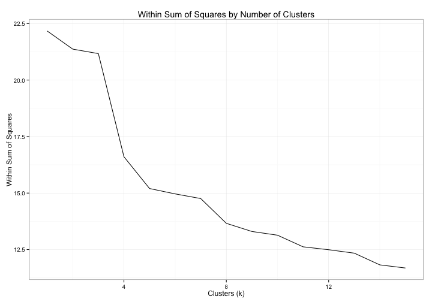
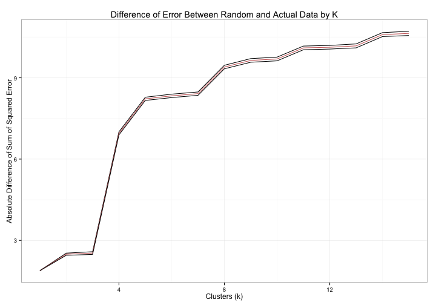

---
title: How Does the State Speak about Globalisation? A Quantitative Text-Mining Approach
author:
- name: Justin Murphy
  affiliation: University of Southampton
  email: j.murphy@soton.ac.uk
date: April 2014
abstract: Scholars argue that the concept of "globalisation" is strategically deployed by governments to rationalise their actions [@Hay:2011dh]. This article is the first large-scale quantitative assessment of this argument, using text-mining and machine learning techniques to analyze more than 60,000 government web pages. Specifically, this article exploits the newly released United Kingdom Government Web Archive to analyze a random sample of web pages published across the entire UK government web system between 2000 and 2013.

...

I requested 150,000 web pages, received 67k and about 1k were errors. Thus, the final sample consists of a corpus of dtm

\pagebreak

### Descriptive Statistics
 

\pagebreak

#### Correlated terms

------------------------
  Terms     Correlation 
---------- -------------
  world        0.78     

 countri       0.66     

 economi       0.63     

  threat       0.62     

 increas       0.61     

   goal         0.6     

   key          0.6     

agricultur     0.59     

   also        0.59     

 develop       0.58     

particular     0.57     

  econom       0.55     

   mani        0.55     

  privat       0.55     

  coher        0.54     

 competit      0.54     

 primari       0.53     

   educ        0.52     

  exampl       0.52     

  howev        0.52     

  integr       0.52     

 success       0.52     

  capac         0.5     

   dfid         0.5     

millennium      0.5     
------------------------

\pagebreak

# Appendix

## Diagnostics

 

  

\pagebreak

# References
\setlength{\parindent}{-0.2in}
\setlength{\leftskip}{0.2in}
\setlength{\parskip}{8pt}
\vspace*{-0.2in}
\noindent
